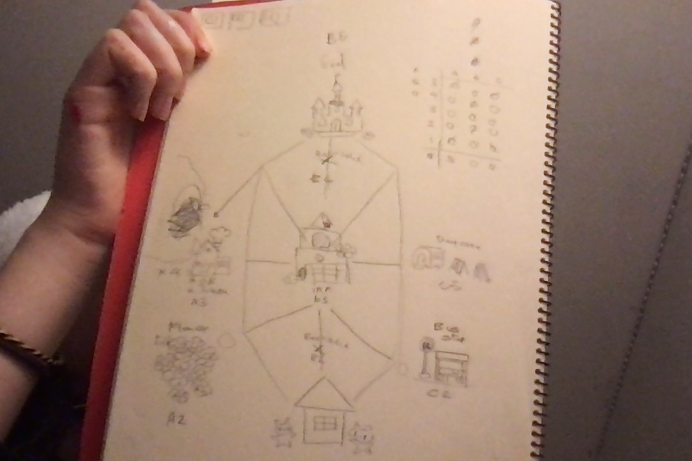

FIRST VERSION IS IN REPOSITORY UNDER THE NAME ; COMP.PY

CRITERIA A [PLANNING] ;

The owner of the local game shop is an enthusiast of classic computer games. He has been looking for a talented programmer that can help him revive his passion for text-based games. He has few requirements for this task:
The game has to be entirely text-based. The game must record the time played. The game must record the player name and score. Apart for this requirements, the owner is open to any type of game, topic or genre.

Solution; Develop a text-based game meeting all criterias provided by customer.

Game topic :Indie RPG Adventure horror

software : python - The reason for this is because of it is the only software currently available to the coder.

Design statement:

I will to design and make a text-based rpg game for a client who is a current game shop owner. The rpg will be made in the ———— and is constructed using the software python on mac processor. It will take 4 weeks to make and will be evaluated according to the following criteria ;

1. The program will be completely text based
2. the program will record the playe's name
3. the program will be able to record the total amount of play time
4. the program will record the player's score in-game in real time
5. The program will be downloadable via online sources
6. Interface written in english
[additional criterias] The program will have different story outcomes depending on player's in-game decisions 

CRITERIA B [DESIGN/TESTING] ; 

[IN GAME MAP DESIGN]

 

[TESTING]

+-------------------------------------------+--------------+-------------------------------------------------------+--------------------+
|           DESCRIPTION                     |   TYPE       |   INPUTS                                              |  EXPECTED OUTPUT   |
+-------------------------------------------+--------------+-------------------------------------------------------+--------------------+
| Testing the player's name record system   | UNIT TESTING | Run program ;                                         | your name          |
|                                           |              | Print(Myplayer.name)                                  |                    |
+-------------------------------------------+--------------+-------------------------------------------------------+--------------------+
| Testing the player class database system  | UNIT TESTING | Run program ;                                         | data               |
|                                           |              | Print(Myplayer.#whatever class data you would like# ) |                    |
+-------------------------------------------+--------------+-------------------------------------------------------+--------------------+
| Testing the timer                         | UNIT TESTING | Run program ;                                         | total playtime     |
|                                           |              | Print(timer)                                          |                    |
+-------------------------------------------+--------------+-------------------------------------------------------+--------------------+
| Testing the score count                   | UNIT TESTING | Print(Myplayer.score)                                 | your in game score |
+-------------------------------------------+--------------+-------------------------------------------------------+--------------------+
| Player class data                         | INTERGRATION | Player_class                                          | info about player  |
+-------------------------------------------+--------------+-------------------------------------------------------+--------------------+

